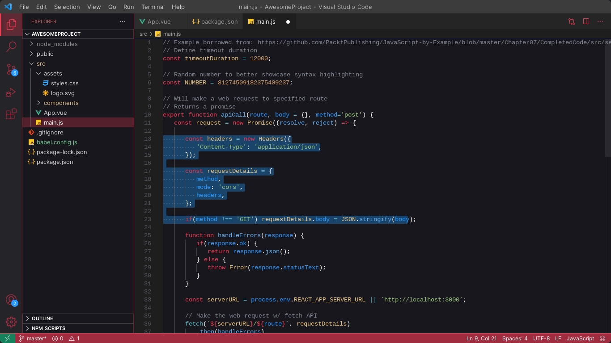

# Hackclub - Vs Code Theme

A theme inspired by the hackclub community. fully open-source as the hackclub itself!

i did this cause my old theme was kinda boring and i wanted to contribute to hackclub in a way no one did!



## Installation

The hackclub theme is not disponible in vscode-marketplace yet... so to download and use hackclub theme you need to download and configure it yourself 💪

To install the hackclub theme follow the steps:

clone the repository:
```js
git clone https://github.com/luanderfarias/hackclub-theme
```
than move the project to the vscode extension folder normally located in:
```js
c:/<your-user>/.vscode/extensions
```

## Updates

Every time you update VS code or the theme gets a update, you will need to repeat this step to reinstall the updates (unless you downloaded it using vscode-marketplace)

## Contributing

I'm really happy to consider any contributions to this theme. Before you make any changes, please read the [license](LICENSE).

## Thanks

Lastly, i want to thanks the hackclub community i've dreamed about a community like this for years...

If you looking for a dev/technology community don't hesitate in joining [hackclub](https://hackclub.com).
